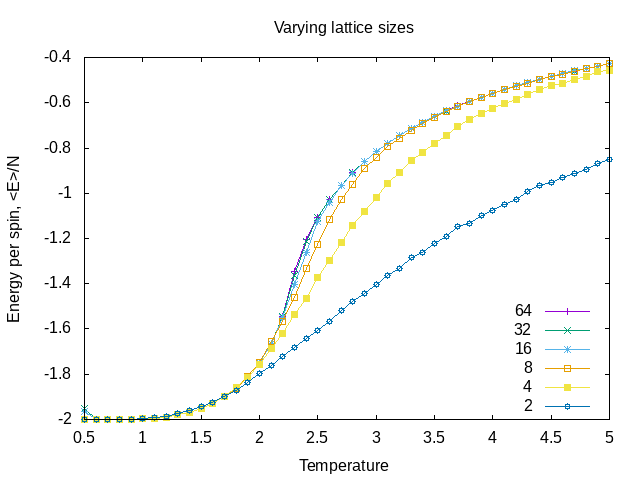
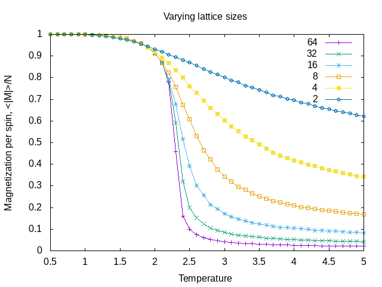

# ISING-MODEL

## Magnetic Materials:

Some atoms have an unpaired electron possessing intrinsic angular momentum such as Fe (iron)

According to the quantum mechanics, the atomic spin can only hold two valus of opposite sign. s and -s. Those also
can be considered as +1 and -1, respectively.

If t spin of material are aligned, the sum of all atomic spins will produce a net magnetic moment of the material: $\langle M \rangle$.

## Simulation:

Real magnetic materials have $\mathcal{O}(10^{23})$ spins. However, infinite systems can mimick with periodic boundary conditions.

Apparently, if there are more spins pointing up than down (or vice versa), the lattice will have
a net magnetization (behaves like a magnet).

In totally disordered state, spins are arranged randomly means no net magnetization.

Instead of calculating averages by averaging over every state, we can select a subset of states. 
States must be chosen without bias:
– Markov chain
– chosen through “random walk”
– satisfy detail balance criterion

Average properties of the system can be estimated as the average from the sampled configurations.

Suggested reading:
• A guide to Monte Carlo simulations in statistical physics
Landau, David P., QC 174.85 M64 L36 2005, QC 174.85 M64 L36 2000

• Understanding molecular simulation: from algorithms to applications, Frenkel, Daan

• http://www.pha.jhu.edu/~javalab/ising/ising.html

## How to run the code:

g++ ising.cpp -o ising.x -Wall
./ising.x

Alternatively, you could use run.sh file which is provided in the repository.

Each simulation has some inputs including:

lattice size: lsize 

equlibration steps: eqsteps 

numberof steps in the simulation: steps 

Temperature range and step: temp 

To analyze the finite size effect, you should run the simulation for different size starting 2*2 to 256*256.

You could use in0#.txt files as input for the simulation (input directory).

## Results

Lattice size and energy:

Lattice size and magnetization:

## Questions

1. Identify the Curie temperature from your plots:

The Curie temperature is the critical point at which a material's intrinsic magnetic
moments change direction, and materials undergo a sharp change in their magnetic
properties. When we see the plots of magnetization, the Curie temperature is the
temperature within we have a change in second derivative of the energy to temperature.
To be sure about the temperature, we can go back to results n the  le and see the
exact temperature that we have this decreasing. Here they are Curie temperature for
each lattice in the table. It is the point that system goes to the phase transition and
correlation length of the system will be the order of magnitude of the system size.

2. Briefly describe the e ect of the size of the lattice on the results of the simulation.

When studying any macroscopic system with a very large number of degrees of freedom,
invariably make an approximation and simulate a smaller and/or discretized model
system. This introduces systematic errors called  nite size e ects. Have to understand 
these, and be able to extrapolate to an in nite system, usually by doing a number of
simulations at di erent system sizes, and a true simulation is when the lattice is large
enough. If you see the results, the critical temperature is changing over the di erent
simulations for di erent lattice sizes. For example, the critical temperature for L = 2 is
about 2:7 and is   2:3 for L = 64. In fact, in the calculation, the systematic error due
to the  nite size e ects decreases with increasing the lattice size. From the mean- eld
approximation, we know the theoretical prediction for the critical temperature is about
2.26. The results show when we increase the lattice size after putting it 32, and then
64, we are very near to the real answer. It means that in order to decrease the  nite
size e ect, we should increase the lattice size because increasing lattice size can assist
us in a realistic simulation that means larger periodic cells. We need to increase the
size of lattice to have realistic results. For instance, when we run the simulation for
L = 128; 256, the answers are very near to the exact critical temperature. Moreover,
the e ect of  nite size is greater for free edges in all cases. A complete real simulation
means when N ! 1 (system has a universality), but its computationally intensive. The
periodic boundary condition assist us to recreate in nite-size results in some respects.
Finally, in phase transition problems two things are important. Critical temperature
and correlation length. In the critical point, the correlation length becomes in the order
of magnitude of the size of the system. It means in the in nite system, it should go to
the in nity. Any physical result is equal when N ! 1. By putting L = 2; 4; 8; 16 we
cannot derive physical meaning of natural system for our simulation. Then by increasing
the lattice size, we are trying to be more and more near to the real physical system.

3. What is the appropriate lattice size for determining $T_{c}$?

The results from the simulation for L = 32, 64 show the system can stabilize the critical
temperature. It means at least; we need 32 as the lattice size to have a good simulation
for the phase transition. The energy plots of these sizes also are adopted with each other.
Apparently, any higher lattice dimension is proposed to have better results.

## Contact:

If you have any question, feel free to contact me by sbazmi@mun.ca

